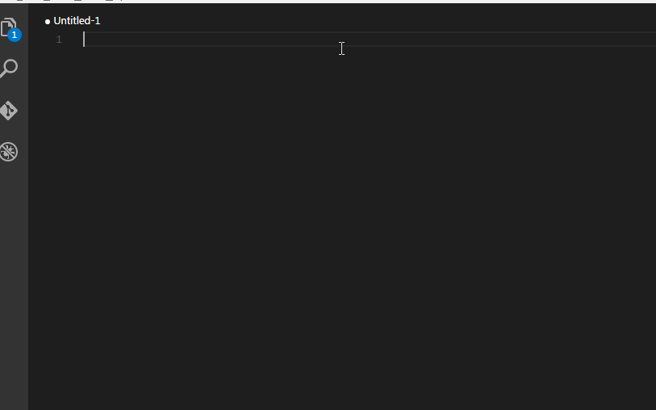
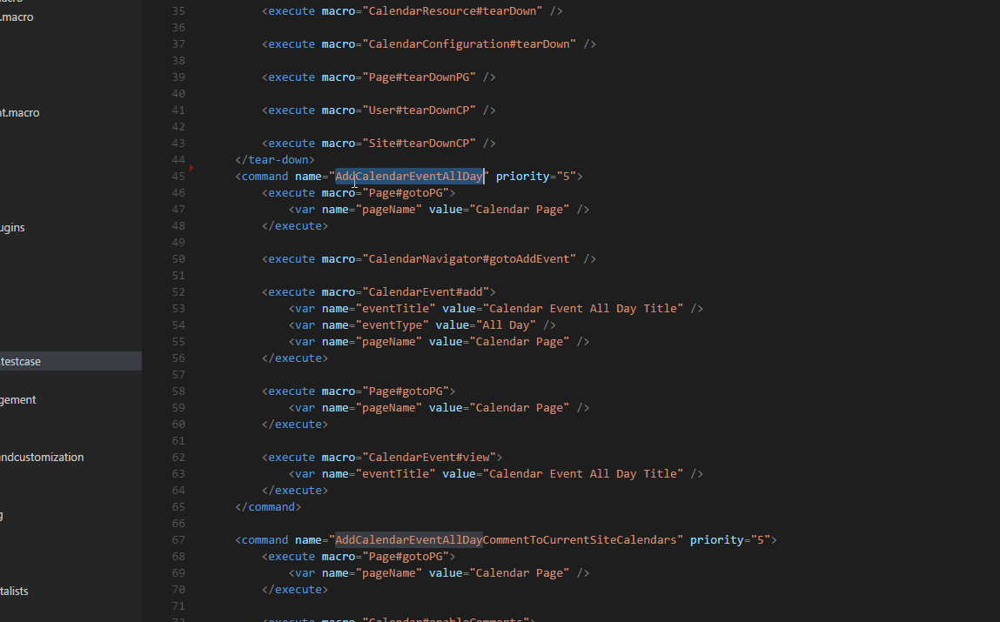

# POSHI

This extension is the support for POSHI in VS Code editor. Why I do this? [HERE](./INSPIRATION.md)

## Installation
In order to install an extension you need to launch the Command Pallete (Ctrl + Shift + P or Cmd + Shift + P) and type `Extensions`. There you have either the option to show the already installed snippets or install new ones.

See more details [HERE](https://marketplace.visualstudio.com/items?itemName=lyon.POSHI).

**Also you can install it manually by using .vsix file, just drag and drop it to your editor.**

## Modules Info
### Linters
All PO Linters:
* Testcase(In Progress)
* Macro(Pending)
* Function(Pending)
* Path(Pending)

To use Linters, you just need to nothing. The Linters will trigger automatically considering the file's extension, eg: .testcase type will trigger testcaseLinter.

The Linters includes two level, **warning** and **error**. The warning level mean the code could be more robust, the error level means the code has errors of syntax and format. 

### Reference Provider
* Definition(In Progress)
* Peek（In Progress)

To use Peek and Definition, please refer to official Docs about [Definition][1] and [Peek][2]. This extension only implements the definition interface about PO files.(.testcase, .macro, .function and .path). The completion feature also works out in Peek View.

### Completion Provider
* IntelliSense(In Progress)
* Hover(Pending)

To use InterlliSense, just same as other rich editor. The extension initialize the all segments about PO object. The InterlliSense menu will display when you type and try to bind the input chars to the ideal segment.

### ~~Debug~~
* ~~Static Debugger(Pending)~~
* ~~Dynamic Debugger(Pending)~~

## Usage Scrennshot
### Snippets

### Linter

### Completion

### Peek

### Definition

## Snippets Lists

Below is a list of all available snippets and the triggers of each one. The **⇥** means the `TAB` key.

### Basic

| Trigger  | Content |
| :------- | ------- |
| **Common** |  |
| `pss⇥` | index Syntax code pattern |
| `comd⇥` | creates a command code block |
| `exe⇥`| create a execute code block with no parameter |
| `vexe⇥` | create a execute code block only with value1 parameter |
| `lexe⇥` | create a execute code block only with locator1 parameter |
| `lvexe⇥` | create a execute code block with locator1 and value1 parameters |
| `var⇥` | create a var declaration code block |
| **Function** |  |
| `df⇥` | create a definition code block for Function |
| `ins⇥` | invoke selenium command |
| **Macro** |  |
| `dm⇥` | create a definition code block for Macro |
| `inf⇥` | invoke function command |.
| `linf⇥` | invoke function command only with locator1 parameter |
| `vinf⇥` | invoke function command only with value1 parameter |
| `lvinf⇥` | invoke function command with locator1 and value1 parameters |
| **Testcase** |  |
| `dt⇥` | create a definition code block for Testcase |
| `comd⇥` | create a command code block |
| `prop⇥` | create a property declaration code block |
| `inm⇥` | invoke Macro command |
| `vinm⇥` | invoke Macro command with one var |
| `vsinm⇥` | invoke Macro command with several vars |
| **Path** |  |
| `dp⇥` | create a definition code block for Path locator |
| `dep⇥` | create a definition code block for empty Path locator |

### Advance
| Trigger  | Content |
| :------- | ------- |
| **Condition & Loop** |  |
| `eq⇥` | create `equals` condition cond segment |
| `cond⇥` | create `condition` condition code segment |
| `ift⇥` | create `if-then` condition code segment |
| `ifte⇥` | create `if-then-else` condition code segment |
| `ifteif⇥` | create `if-then-elseif` condition code segment |
| `eif⇥` | create `else-if` condition code segment |
| `el⇥` | create `else` condition code segment |
| `whth⇥` | create `while-then` loop code segment| 
| `for⇥` | create `for` loop code segment |
| **Others** |  |
| `svcomd⇥` | declare a var and invoke function with it in Macro |

## Custom Snippets
You could also define your own snippets. You need to launch the Command Pallete (Ctrl + Shift + P or Cmd + Shift + P) and type `Preference Snippets`. Then you can override existed snippets or define your own snippets !!

**Enjoy!**

[1]: https://code.visualstudio.com/docs/editor/editingevolved#_go-to-definition
[2]: https://code.visualstudio.com/docs/editor/editingevolved#_peek