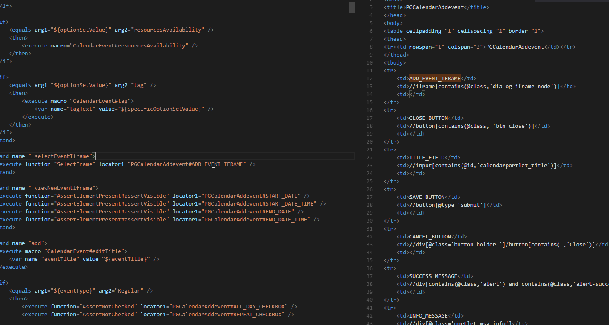
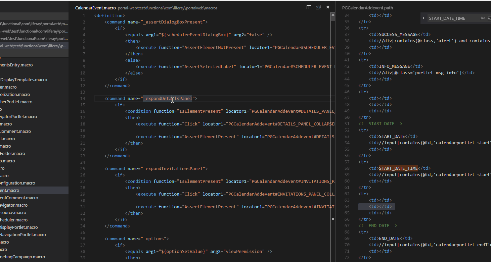

# POSHI

This extension is the support for POSHI in VS Code editor. 

Met some problems? You could refer [HERE](https://github.com/haoliangwu/vscode-poshi/wiki/Snippets-List-Doc).

Why I do this? READ [THIS](./INSPIRATION.md). Sorry for it was written by chinese.

## Installation
In order to install an extension you need to launch the Command Pallete (Ctrl + Shift + P or Cmd + Shift + P) and type `Extensions`. There you have either the option to show the already installed snippets or install new ones.

See more details [HERE](https://marketplace.visualstudio.com/items?itemName=lyon.POSHI).

**Also you can install it manually by using .vsix file, just drag and drop it to your editor.**

## Modules Info
### Shortcut key
``alt + P``: open a testcase file by syntax like 'CPBlogs#RateBlogsEntry', you will enter CPBlogs.testcase shortly.

### Linters
All PO Linters:
* Testcase(In Progress)
* Macro(Pending)
* Function(Pending)
* Path(Pending)

To use Linters, you just need to nothing. The Linters will trigger automatically considering the file's extension, eg: .testcase type will trigger testcaseLinter.

The Linters includes two level, **warning** and **error**. The warning level mean the code could be more robust, the error level means the code has errors of syntax and format. 

### Symbol & Hover
* Symbol(In Progress)
* Hover(Pending)

This module just the implement of Symbol & Hover interface for POSHI(command block shortcut). 

To use Symbol just use (Ctrl + Shift + O or Cmd + Shift + O) to trigger Command Pallete and type the Symbol key, then focus will move to that command block. 

To use Hover just hover the mouse on KEY(eg: locator key), then the info panel will diaplay and show the infomation about the KEY.

### Reference Provider
* Definition(In Progress)
* Peek（In Progress)

To use Peek and Definition, please refer to official Docs about [Definition][1] and [Peek][2]. This extension only implements the definition interface about PO files.(.testcase, .macro, .function and .path). The completion feature also works out in Peek View.

### Completion Provider
* IntelliSense(In Progress)
* Hover(Pending)

To use InterlliSense, just same as other rich editor. The extension initialize the all segments about PO object. The InterlliSense menu will display when you type and try to bind the input chars to the ideal segment.

### ~~Debug~~
* ~~Static Debugger(Pending)~~
* ~~Dynamic Debugger(Pending)~~

## Usage Screenshot
### Snippets
> Generate the common templates with shortcut keys, even custom ones.

### Linter
> Give you instant hints about syntax or format issues.

### Completion
> Offer word completion by input text.

### Peek
> You can view reference files through Peek View, even edit.

### Definition
> Go to reference files directly by clicking the key word.

### Hover
> Give you instant value of variates, eg: locator and its value.

### Symbol
> You can focus on specific position of file by these symbols, say goodbye to search.

## Snippets Lists

The doc of whole triggers is [HERE](https://github.com/haoliangwu/vscode-poshi/wiki/Snippets-List-Doc)

[1]: https://code.visualstudio.com/docs/editor/editingevolved#_go-to-definition
[2]: https://code.visualstudio.com/docs/editor/editingevolved#_peek